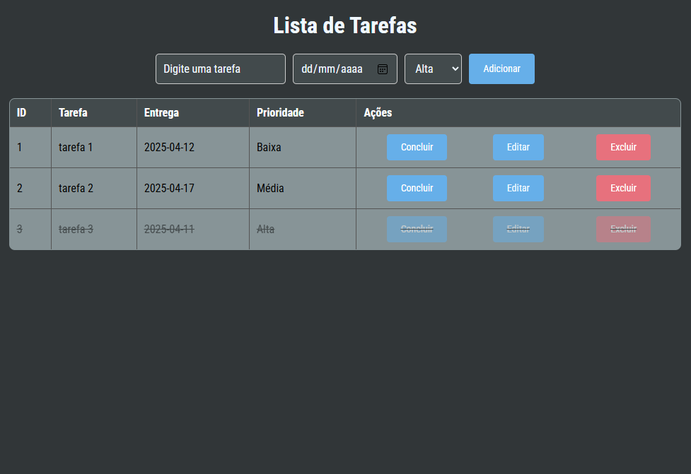
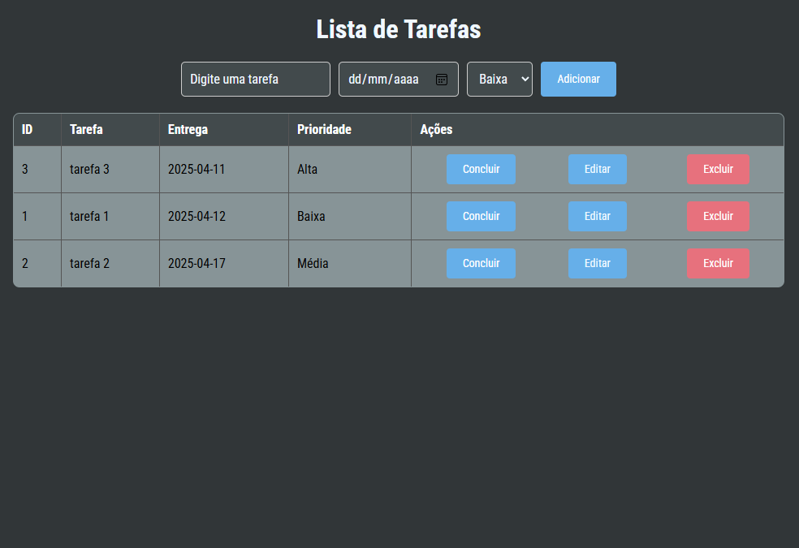

# 📝 ToDo List

Uma aplicação web simples de lista de tarefas desenvolvida com **HTML**, **CSS** e **JavaScript**.

## Funcionalidades

- ✅ **Adicionar tarefas** com:
  - Descrição
  - Data
  - Prioridade (ex: Alta, Média, Baixa)
- **Editar tarefas**
- **Marcar tarefas como concluídas**
- **Excluir tarefas**
- **Organização automática**:
  - Tarefas concluídas aparecem no final da lista e com texto tachado
  - Tarefas excluídas são removidas da tela

